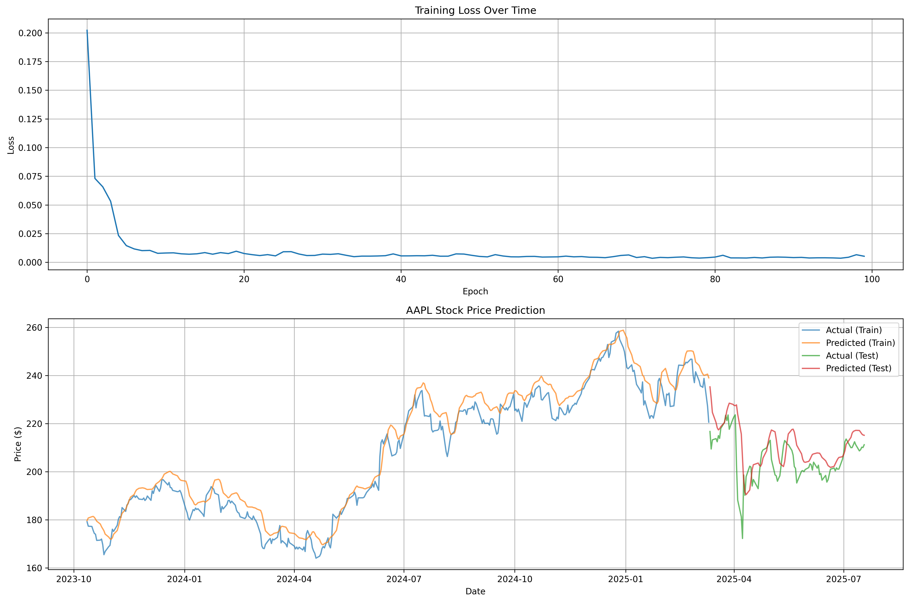

Stock Price Prediction using PyTorch LSTM

A deep learning project that predicts stock prices using Long Short-Term Memory (LSTM) networks implemented in PyTorch. This project demonstrates time series forecasting, neural network architecture design, and financial data analysis.

 Features

- **Real-time Data**: Fetches live stock data using Yahoo Finance API
- **LSTM Neural Network**: Custom PyTorch implementation with dropout regularization
- **Comprehensive Evaluation**: RMSE and MAE metrics with visualization
- **GPU Support**: Automatic CUDA detection and utilization
- **Scalable Architecture**: Easy to modify for different stocks and parameters

Model Architecture

```
LSTM(input=1, hidden=50, layers=2) → Dropout(0.2) → Dense(1)
```

- **Input**: 60-day historical prices (sliding window)
- **Hidden Units**: 50 per LSTM layer
- **Layers**: 2 LSTM layers with dropout
- **Output**: Next day's closing price

Installation

```bash
git clone https://github.com/shatansh0710/stock-price-prediction
cd stock-price-prediction
pip install -r requirements.txt
```

Usage

Basic Usage
```python
from stock_predictor import StockPredictor

# Initialize predictor
predictor = StockPredictor(symbol='AAPL', period='2y')

# Train and evaluate
predictor.fetch_data()
predictor.preprocess_data()
predictor.build_model()
predictor.train_model(epochs=100)
predictor.evaluate_model()
predictor.plot_results()
```

Custom Parameters
```python
# Different stock and parameters
predictor = StockPredictor(
    symbol='TSLA',           # Stock symbol
    period='5y',             # Data period
    lookback=30              # Days to look back
)

predictor.build_model(
    hidden_size=100,         # Hidden units
    num_layers=3,            # LSTM layers
    dropout=0.3              # Dropout rate
)

predictor.train_model(
    epochs=200,              # Training epochs
    batch_size=64,           # Batch size
    lr=0.0005               # Learning rate
)
```

Results

The model achieves:
- **Training RMSE**: ~$2-6 (depending on stock volatility)
- **Test RMSE**: ~$4-10 (depending on market conditions)
- **Convergence**: Usually within 70-100 epochs

Output after first run:-
Training model...
Epoch [20/100], Loss: 0.009672
Epoch [40/100], Loss: 0.007335
Epoch [60/100], Loss: 0.004681
Epoch [80/100], Loss: 0.004056
Epoch [100/100], Loss: 0.005287
Training completed!

--- Model Performance ---
Train RMSE: $5.99
Test RMSE: $10.00
Train MAE: $4.86
Test MAE: $7.20
Project Structure

```
the evaluation figure generated:-

stock-price-prediction/
│
├── stock_predictor.py      # Main implementation
├── requirements.txt        # Dependencies
├── README.md              # This file
└── AAPL_prediction.png    # Generated plots
└──AAPL_lstm_model.pth     #output model
```

Key Features

1. **Custom PyTorch Implementation**
2. **Proper Data Pipeline**
3. **Model Evaluation**
4. **Clean Code**
5. **Real-world Application**

Technical Highlights

- **Time Series Preprocessing**: Sliding window approach with proper train/test split
- **LSTM Architecture**: Handles vanishing gradient problem in sequential data
- **Regularization**: Dropout layers prevent overfitting
- **Scalability**: Easy to extend for multiple features or different architectures
- **Visualization**: Professional plots for model analysis


```bash
python stock_predictor.py
```

This will:
1. Download 2 years of Apple stock data
2. Train an LSTM model for 100 epochs
3. Generate performance metrics
4. Create visualization plots
5. Save the trained model

Customization

Different Stocks
```python
predictor = StockPredictor(symbol='GOOGL')  # Google
predictor = StockPredictor(symbol='MSFT')   # Microsoft
```

Extended Features
- Add volume, moving averages, or technical indicators
- Implement attention mechanisms
- Use transformer architectures
- Multi-step ahead prediction


MIT License - feel free to use for personal projects and learning.

Contributing

This is a learning project, but suggestions and improvements are welcome!

